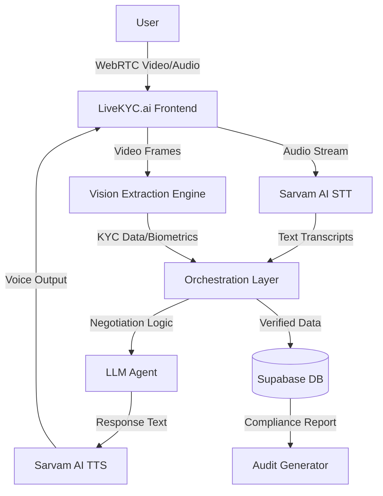

# 🧬 LiveKYC.ai 
### *The Future of Loan Onboarding: Real-Time AI Video Verification*

[](https://reactjs.org/)
[](https://vitejs.dev/)
[](https://tailwindcss.com/)
[](https://supabase.com/)
[](https://www.sarvam.ai/)

---

## 🚀 Overview

**LiveKYC.ai** is an end-to-end, autonomous loan onboarding platform that replaces traditional forms and manual branch visits with a **live AI video interview**. Developed during the **2026 AI Hackathon**, it leverages cutting-edge computer vision, generative AI, and real-time audio processing to verify identity and approve loans in under 5 minutes.

> **"No Forms. No Branches. Approved in Minutes."**

---

## ✨ Key Features

- **🎥 Live AI Interviewer:** A conversational AI agent that conducts the KYC interview through a live video call, capturing data naturally.
- **📄 Real-Time KYC Extraction:** Instant OCR and validation of identity documents (like Aadhaar) directly during the video stream.
- **🛡️ Biometric Fraud Detection:** Advanced facial analysis and liveness detection to identify and flag biometric risks immediately.
- **⚡ Instant Loan Approval:** On-the-fly generation of customized loan structures based on real-time behavioral and financial assessment.
- **📜 Immutable Audit Trail:** Every session generates a tamper-evident, SHA-256 hashed audit report for complete regulatory compliance.

---

## 🛠️ Tech Stack

### Frontend
- **Framework:** React 19 + Vite (Ultra-fast HMR)
- **Styling:** Tailwind CSS + Vanilla CSS (Custom Design System)
- **Animations:** Framer Motion (Cinematic UI/UX)
- **Icons:** Lucide React

### Backend & AI
- **Runtime:** Node.js (Express)
- **Database:** Supabase (PostgreSQL + Real-time subscriptions)
- **Voice AI:** Sarvam AI (Indic Language Text-to-Speech)
- **Intelligence:** LLM-driven extraction and negotiation agents
- **Biometrics:** Custom Computer Vision processing for face/age markers

---

## 🏗️ Architecture



---

## 🚀 Getting Started

### Prerequisites
- Node.js (v18+)
- Supabase Account
- Sarvam AI API Key

### Installation

1. **Clone the repository:**
   ```bash
   git clone https://github.com/vaibhav555s/LiveKYC.ai.git
   cd LiveKYC.ai
   ```

2. **Install dependencies:**
   ```bash
   npm install
   ```

3. **Environment Setup:**
   Create a `.env` file in the root and add your credentials (see `.env.example`):
   ```env
   VITE_SUPABASE_URL=your_url
   VITE_SUPABASE_ANON_KEY=your_key
   VITE_SARVAM_API_KEY=your_sarvam_key
   ```

4. **Run Development Server:**
   ```bash
   npm run dev
   ```

---

## 👔 For Recruiters

### Engineering Highlights
- **Real-Time Data Pipelines:** Implemented complex WebRTC and MediaStream handling for live data extraction.
- **System Orchestration:** Developed a robust `sessionOrchestrator` to manage multi-step AI states (Chat -> Verify -> Face Scan -> Offer).
- **Compliance First:** Built an immutable audit system ensuring data integrity and regulatory standards.
- **Modern UI/UX:** Crafted a high-fidelity, "Superconscious" dark-themed design focusing on accessibility and performance.

---


## 📄 License
This project is licensed under the MIT License - see the [LICENSE](LICENSE) file for details.

---

<p align="center">
  Built with ❤️ for the future of Finance.
</p>
